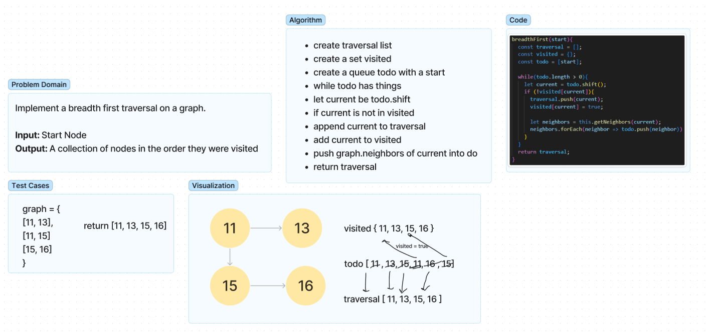
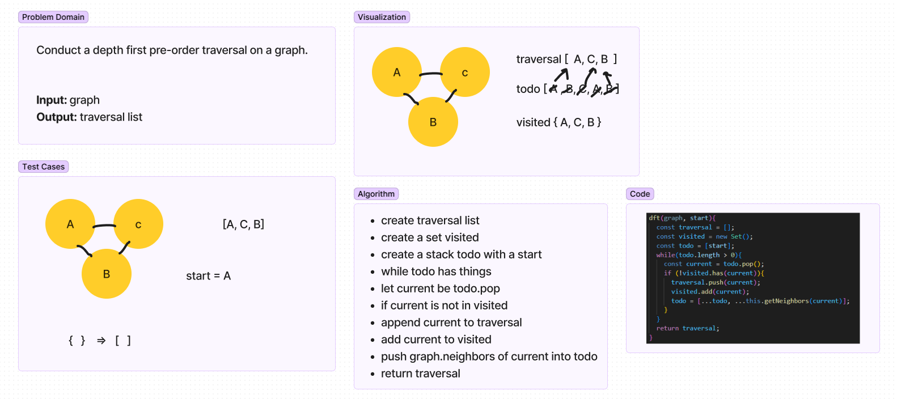

# Breadth First Traversal
Write a following method for the Graph class:

  - breadthFirst
  - Arguments: start node
  - Return: A collection of nodes in the order they were visited
  - Display the collection

## Whiteboard

## Approach & Efficiency
- create traversal list
- create a set visited
- create a queue todo with a start
- while todo has things
- let current be todo.shift
- if current is not in visited
- append current to traversal
- add current to visited
- push graph.neighbors of current into do
- return traversal

# Depth First Traversal
Conduct a depth first pre-order traversal on a graph:

- depthFirst
- Arguments: start node
- Return: A collection of nodes in their pre-order depth-first traversal order
- Display the collection

## Whiteboard

## Approach & Efficiency
- create traversal list
- create a set visited
- create a stack todo with a start
- while todo has things
- let current be todo.pop
- if current is not in visited
- append current to traversal
- add current to visited
- push graph.neighbors of current into todo
- return traversal
