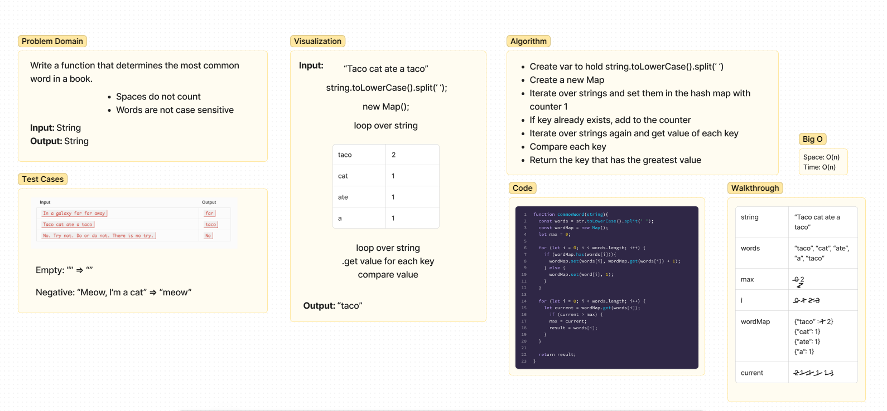

# Hashmap Common Word
Write a function that determines the most common word in a book.
- Spaces do not count
- Words are not case sensitive
- Input: string
- Output: string

## Whiteboard

## Approach & Efficiency
Time & Space: O(n). Search all of elements.

## Solution
- Create var to hold string.toLowerCase().split(‘ ‘)
- Create a new Map
- Iterate over strings and set them in the hash map with counter 1
- If key already exists, add to the counter
- Iterate over strings again and get value of each key
- Compare each key
- Return the key that has the greatest value
