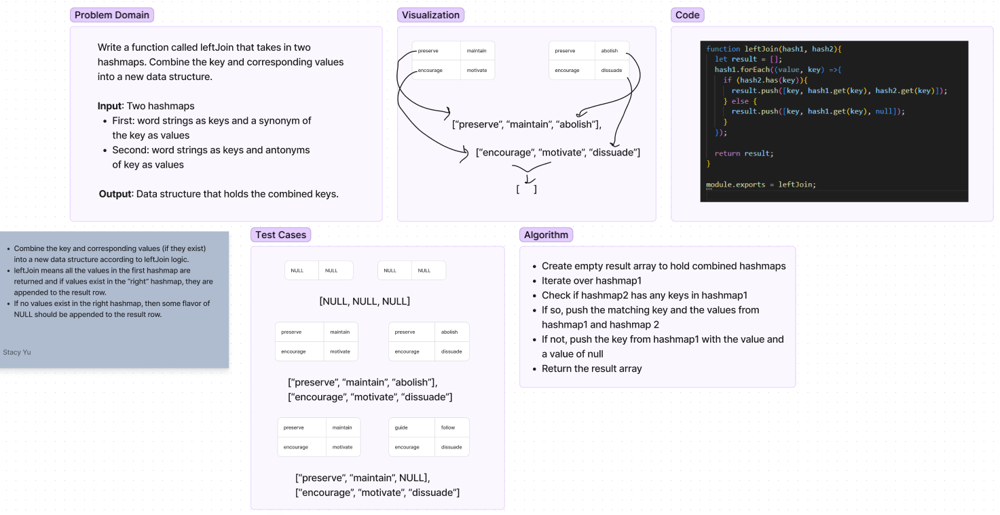

# Hashmap Left Join
Write a function called leftJoin that takes in two hashmaps.
- Combine the key and corresponding values (if they exist) into a new data structure according to leftJoin logic.
- leftJoin means all the values in the first hashmap are returned and if values exist in the “right” hashmap, they are appended to the result row.
- If no values exist in the right hashmap, then some flavor of NULL should be appended to the result row.
- Input: Two hashmaps
    - First: word strings as keys and a synonym of the key as values
    - Second: word strings as keys and antonyms of key as values
- Output: Data structure that holds the combined keys and corresponding values.

## Whiteboard

## Approach & Efficiency
Time & Space: O(m). Search all of keys in first hashmap mth times.

## Solution
- Create empty result array to hold combined hashmaps
- Iterate over hashmap1
- Check if hashmap2 has any keys in hashmap1
- If so, push the matching key and the values from hashmap1 and hashmap 2
- If not, push the key from hashmap1 with the value and a value of null
- Return the result array
