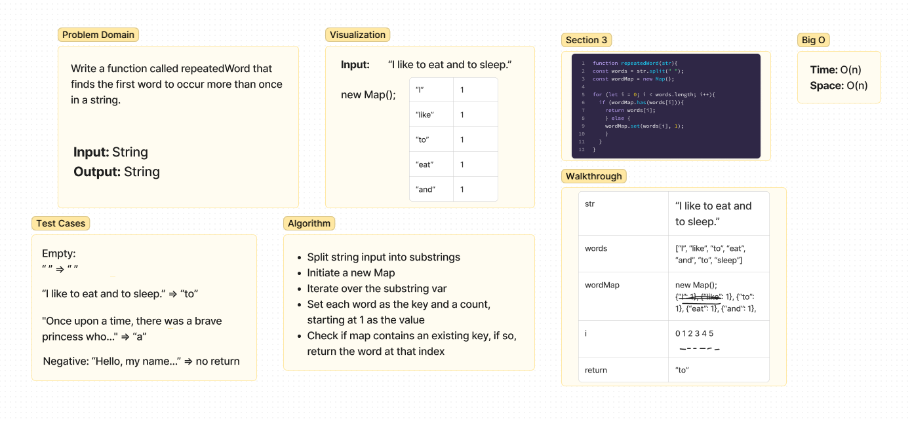

# Repeated Word
Write a function called repeated word that finds the first word to occur more than once in a string
- Arguments: string
- Return: string

## Whiteboard Process

## Approach & Efficiency
Time & Space: O(m). Our first repeated word is present at Mth index.

## Solution
- Split string input into substrings
- Initiate a new Map
- Iterate over the substring var
- Set each word as the key and a count, starting at 1 as the value
- Check if map contains an existing key, if so, return the word at that index
