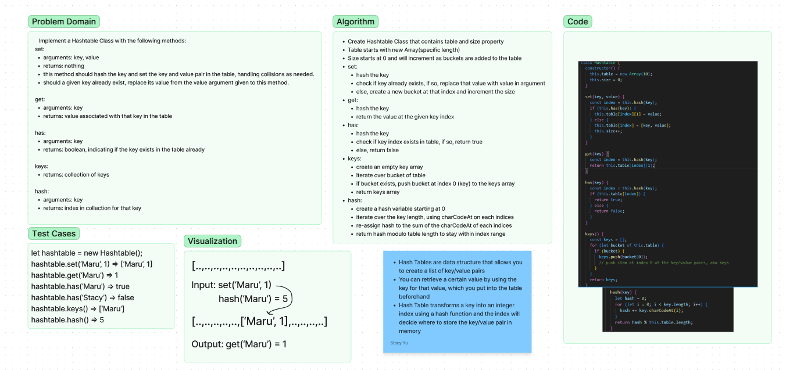

# Hashtable
## Implement a Hashtable Class with the following methods:
- set
  - Arguments: key, value
  - Returns: nothing
  - This method should hash the key, and set the key and value pair in the table, handling collisions as needed.
  - Should a given key already exist, replace its value from the value argument given to this method.
- get
  - Arguments: key
  - Returns: Value associated with that key in the table
- has
  - Arguments: key
  - Returns: Boolean, indicating if the key exists in the table already.
- keys
  - Returns: Collection of keys
- hash
  - Arguments: key
  - Returns: Index in the collection for that key

## Whiteboard

Write tests to prove the following functionality:

1. Setting a key/value to your hashtable results in the value being in the data structure
2. Retrieving based on a key returns the value stored
3. Successfully returns null for a key that does not exist in the hashtable
4. Successfully returns a list of all unique keys that exist in the hashtable
5. Successfully handle a collision within the hashtable
6. Successfully retrieve a value from a bucket within the hashtable that has a collision
7. Successfully hash a key to an in-range value
