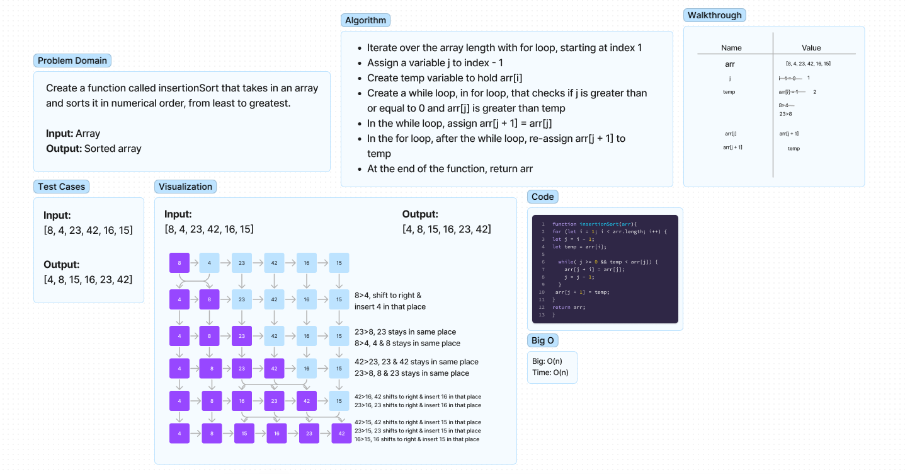

# Insertion Sort
Create a function called insertionSort that takes in an array and sorts it in numerical order, from least to greatest.
- Input: Array
- Output: Sorted array

## Whiteboard Process

## Approach & Efficiency
- Used the pseudo code as a guide
- Looped over the array length with a for loop, while starting i at 1
- Assign a variable j to i - 1
- Assign a temp variable to arr[i]
- Create while loop in the for loop that checks if j is greater than and equal to 0 AND temp is less than arr[j]
- If so, assign arr[j + 1] to arr[j]
- Also, re-assign j to j - 1
- Then outside of the while loop, assign arr[j + 1] to temp
- Outside of both loops, return arr 
