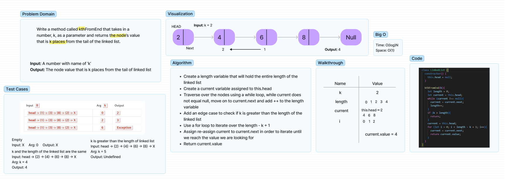

# Find kth Value From End of Linked List
Write the following method for the Linked List class:
- kth from end:
- Argument: a number, k, as a parameter
- Return the node's value that is k places from the tail of the linked list
- You have access to the Node class and all the properties on the Linked List class as well as the methods created in previous challenges

## Whiteboard Process

## Approach & Efficiency
I traversed through the linked list first in order to find the entire length of it.
Afterwards, I used a for loop to iterate over the length of the linked list adding (length - k + 1) as the conditional statement.
