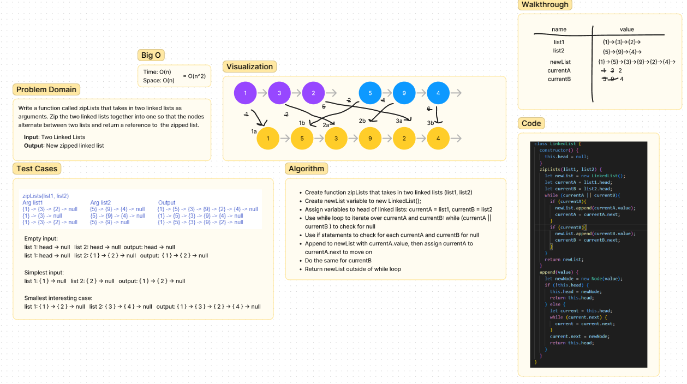

# Zip Two Linked Lists
Write a function called zipLists that takes in two linked lists as arguments. Zip the two linked lists together into one so that nodes alternate between two lists and returns a reference to the zipped list.
- Input: Two Linked List
- Output: New zipped Linked List

## Whiteboard Process

## Approach & Efficiency
- Create function zipLists that takes in two linked lists (list1, list2)
- Create newList variable to new LinkedList();
- Assign variables to head of linked lists: currentA = list1, currentB = list2
- Use while loop to iterate over currentA and currentB: while (currentA || currentB ) to check for null
- Use if statements to check for each currentA and currentB for null
- Append to newList with currentA.value, then assign currentA to currentA.next to move on
- Do the same for currentB
- Return newList outside of while loop
