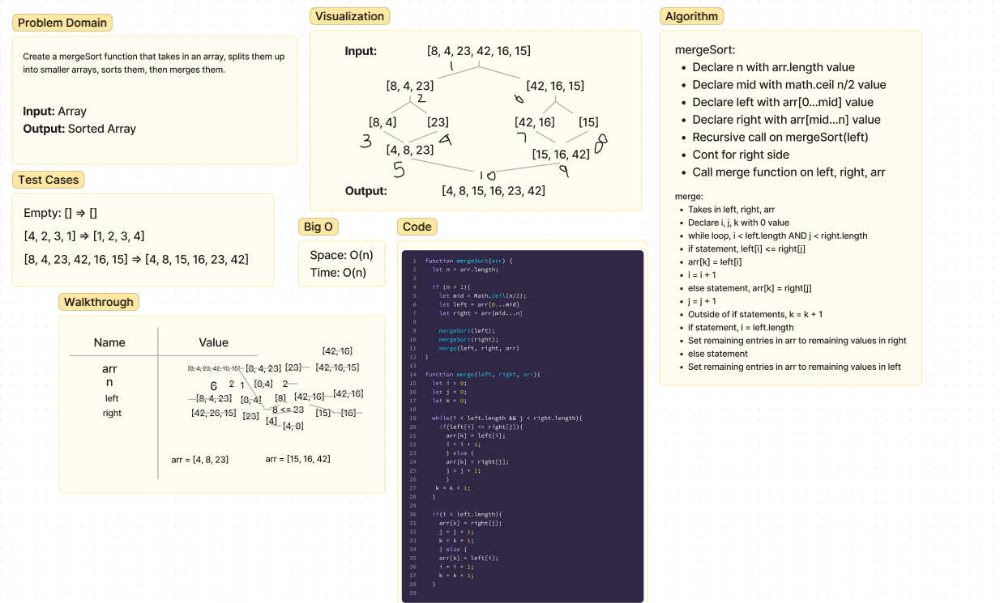

# Insertion Sort
Create a function called mergeSort that takes in an array, splits them up into smaller arrays, sorts them, then merges them.
- Input: Array
- Output: Sorted array

## Whiteboard Process

## Approach & Efficiency
mergeSort:
- Declare n with arr.length value
- Declare mid with math.ceil n/2 value
- Declare left with arr[0...mid] value
- Declare right with arr[mid...n] value
- Recursive call on mergeSort(left)
- Cont for right side
- Call merge function on left, right, arr

merge:
- Takes in left, right, arr
- Declare i, j, k with 0 value
- while loop, i < left.length AND j < right.length
- if statement, left[i] <= right[j]
- arr[k] = left[i]
- i = i + 1
- else statement, arr[k] = right[j]
- j = j + 1
- Outside of if statements, k = k + 1
- if statement, i = left.length
- Set remaining entries in arr to remaining values in right
- else statement
- Set remaining entries in arr to remaining values in left
