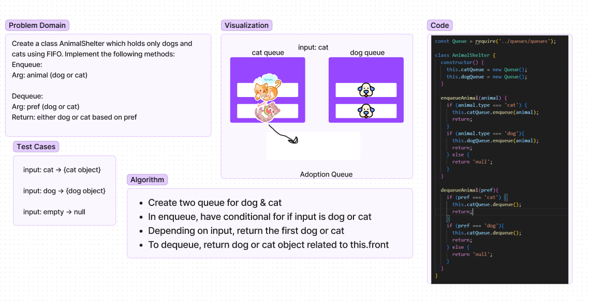

# First In, First Out Animal Shelter
Create a class AnimalShelter which holds only dogs and cats. Implement the following methods: enqueue (arg animal), dequeue (args pref).

## Whiteboard Process

## Approach & Efficiency
- Create two queues for dog & cat
- In enqueue, have a conditional for if input is either dog or cat
- Depending on input, enqueue the first dog or cat in the queues
- To dequeue, depending on preference, return first dog or cat
