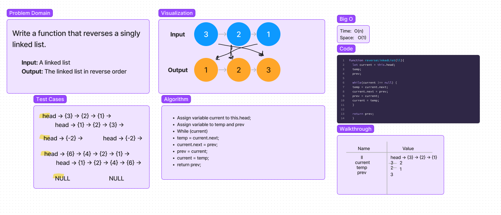

# Reverse a Linked List
Write a function to reverse a Singly Linked List.

## Whiteboard Process

## Approach & Efficiency
Iterating over the linked list and assigning the current, previous, and next node to a value. In every iteration, when the next node is stoed, the current node's next pointer is referreing to the stored previous node.
