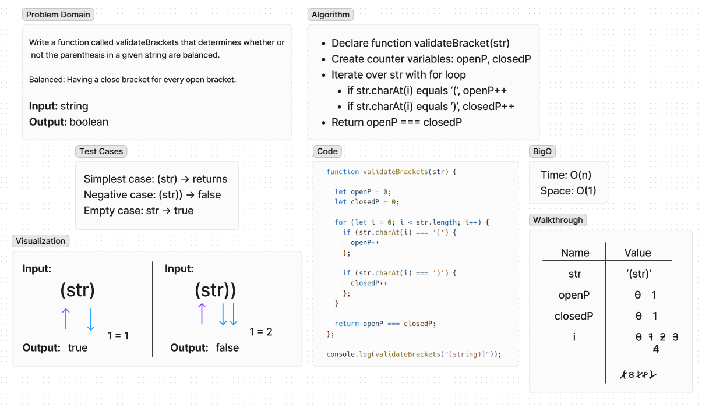

# Validate Brackets
Write a function called validateBrackets that takes in a string and returns a boolean, representing whether or not the brackets in the string are balanced.

## Whiteboard Process

## Approach & Efficiency
- Iterate over the string with a for loop
- Used str.charAt(i) in the for loop to identify if the value matches ( or )
- Use counter variables for openP and closedP to count each time ( and ) are present in the string
- Compare the value of openP and closedP, it will return either true or false
