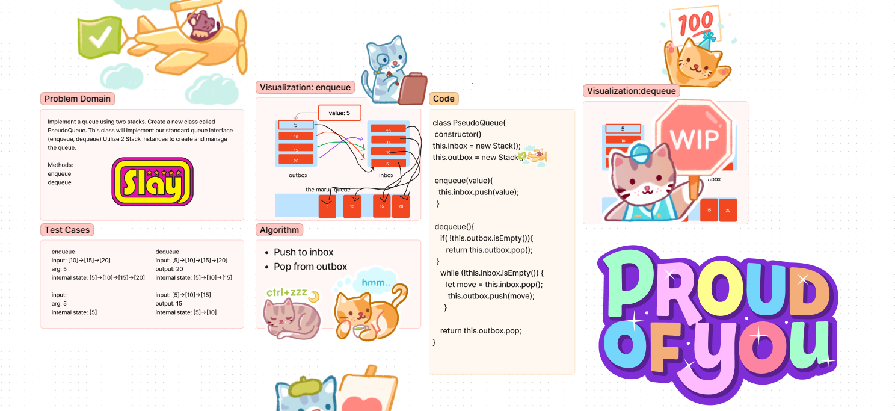

# Pseudo Queue
Implement a Queue using two Stacks. Create a class PseudoQueue, implementing our standard queue methods: enqueue and dequeue. Utilize two Stack instances to create and manage the queue.

## Whiteboard Process

## Approach & Efficiency
- Create constructor props inbox and outbox, these will be assigned to two new Stack instances
- enqueue method will take in a value, the function will push the value into inbox
- dequeue method will first check if the outbox isEmpty, if not then return outbox pop
- Otherwise, use a while loop to iterate over the inbox
- Pop the inbox and push it into the outbox
- Lastly, return the outbox pop
