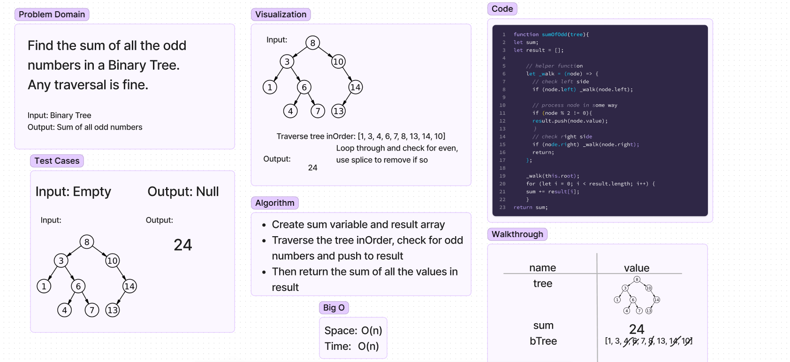

# Sum of All Odds Numbers
Find the sum of all odd numbers in a binary tree. Any of the traversals are acceptable.

## Whiteboard Process

## Approach & Efficiency
- Create a sumOfOdds function that takes in a tree.
- Create empty sum variable and empty result array.
- Create helper function that will be used for recursion.
- Function traverses inOrder, and pushes the node.value into the result array if it is an odd number.
- After traversal is finished, loop through the result array and add each value to sum.
- Return sum. 
