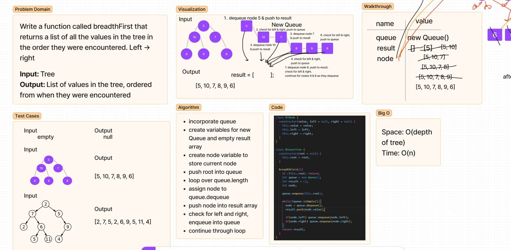

# Code Challenge 17: Breadth-first Traversal
Write a function called breadth first that traverses the a tree and returns a list of all the values in the tree, in the order they were encountered.

## Whiteboard Process

## Approach & Efficiency
- Base case to check if root exists
- Incorporate a queue
- Instantiate a queue, create empty result array, and instantiate node variable to hold current node
- Push root into queue
- Loop over queue, as long as it is not empty
- Assign node to the the node that is dequeued from queue
- Push node.value into result array
- Check for left and right children nodes and enqueue into queue
- Continue through the loop until it's empty
- Return the result array 
