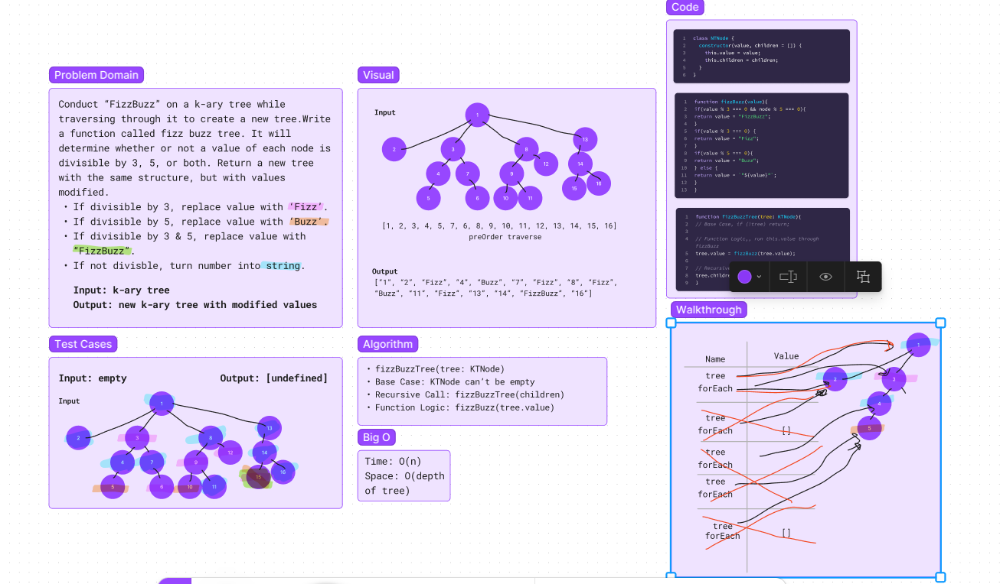

# Fizz Buzz Tree
Conduct a "FizzBuzz" on a k-ary tree while traversing through it to create a new tree. Input: k-ary tree, output: new k-ary tree with modified values.

## Whiteboard Process

## Approach & Efficiency
- Create fizzBuzzTree function that takes in tree: KTNode
- Write out base case, which would check if tree is empty
- Create function logic, which assigns tree.value to the result of calling fizzBuzz on tree.value
- Write a recursive call which will call the fizzBuzzTree function on each of the children
