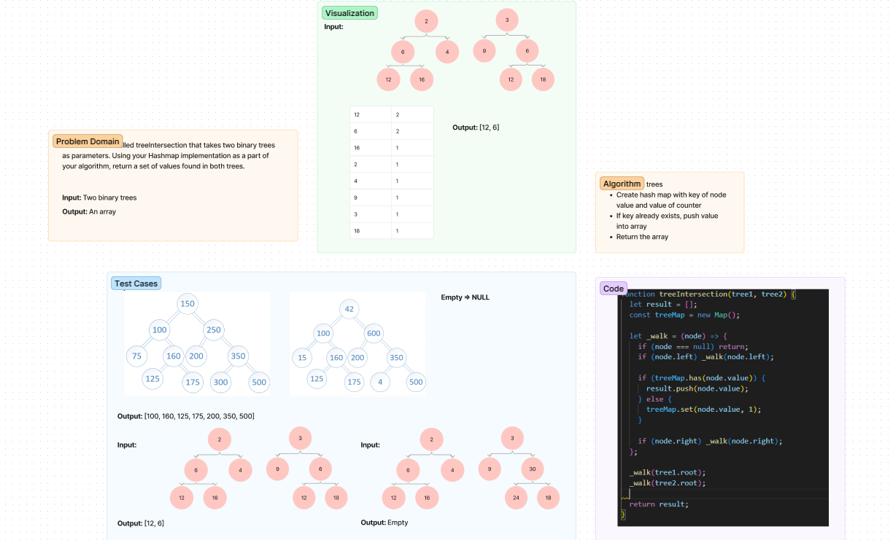

# Tree Intersection
Write a function called treeIntersection that takes two binary trees as parameters. Using your Hashmap implementation as a part of your algorithm, return a set of values found in both trees.
- Arguments: Two Binary Trees
- Return: Array

## Whiteboard Process

## Approach & Efficiency
Time & Space: O(n). Traverses through each node and checks for existing key in map.

## Solution
- Traverse trees in order
- Create hash map with key of node value and value of counter
- If key already exists, push value into array
- Return the array
