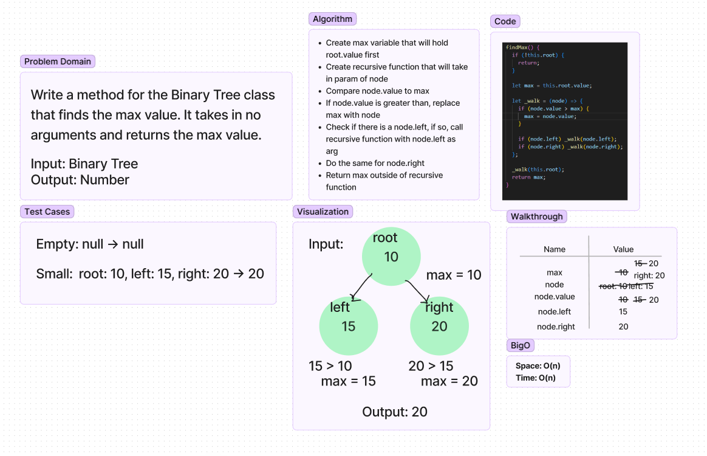

# Binary Tree Max Value
- Find the maxValue in a Binary Tree.
- This will be implemented as a method in the Binary Tree Class.
- Arguments: tree
- Returns: number

## Whiteboard Process

## Approach & Efficiency
- Base case: check if root exists
- Create a max variable that will start by holding the root value
- Create a helper function that will be used for recursion
- Helper function takes in a node parameter
- Create function logic that checks if the node value is greater than the current max, if so, the node will become the new max
- Check for left and right, if so, call helper functions on these nodes
- Cycle will continue until all nodes are checked and we will return the max value at the end
- Make sure to call the helper function starting with the root node
