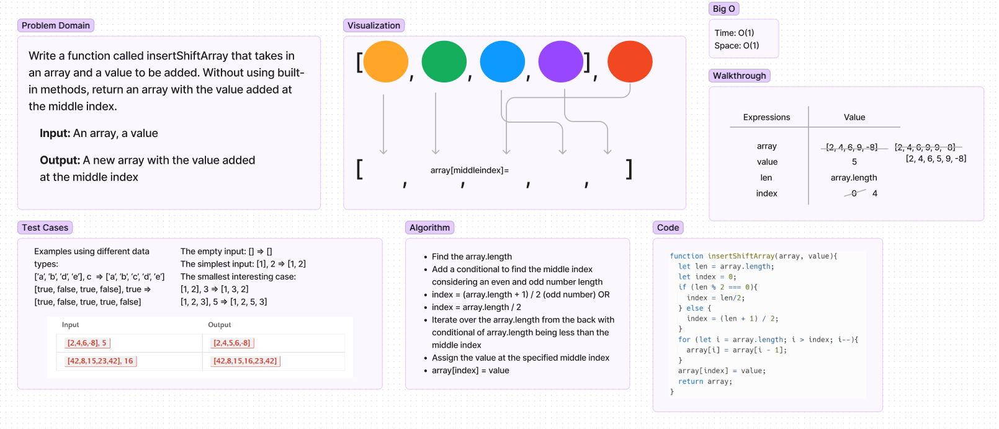

# Insert to Middle of an Array
Write a function called insertShiftArray that takes in an array and a value to be added. Without using built-in methods, return an array with the value added at the middle index.

## Whiteboard Process

## Approach & Efficiency
I used a conditional to decide what the midpoint index would
be depending on if the length of the array is even or odd. Then using a for loop with i equal to array.length, conditional of i being more than index variable, then decrementing i. I then assigned the array at the midpoint index to the value being added. 
