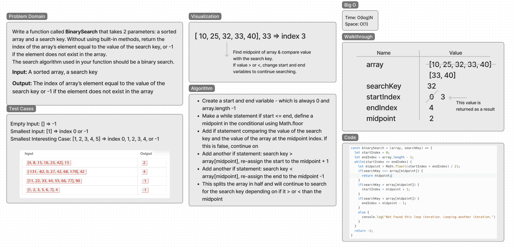

# Binary Search
Write a function called BinarySearch that takes 2 parameters: a sorted array and a search key. Without using built-in methods, return the index of the array’s element equal to the value of the search key, or -1 if the element does not exist in the array.
The search algorithm used in your function should be a binary search.

## Whiteboard Process

## Approach & Efficiency
- I created start, end, and midpoint variables in order to handle the portion of the array to search in and to find the index of the search key.
- The midpoint is created in a while loop to make sure that the start is <= the end.
- In the while loop, there is a conditional if statement comparing the value of the search key to the value of the element at the midpoint of the array.
- If these are equal, then the index is found. If it is not equal, it continues down the conditional statements.
- If the search key > the value of the element at the midpoint of the array, the start index is re-assigned to the midpoint + 1.
- If the search key is <, the end index is re-assigned to the midpoint - 1.
- This will slice the array on the left or the right of the midpoint in order to continue searching. 
