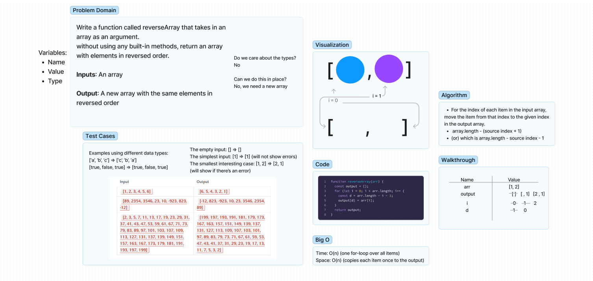

# Reverse an Array
Write a function called reverseArray that takes in an array as an argument.
Without using any built-in methods, return an array with elements in reversed order.

## Whiteboard Process

## Approach & Efficiency
I used a for loop for this approach because it seemed to be the simplest way with the knowledge I currently have.
